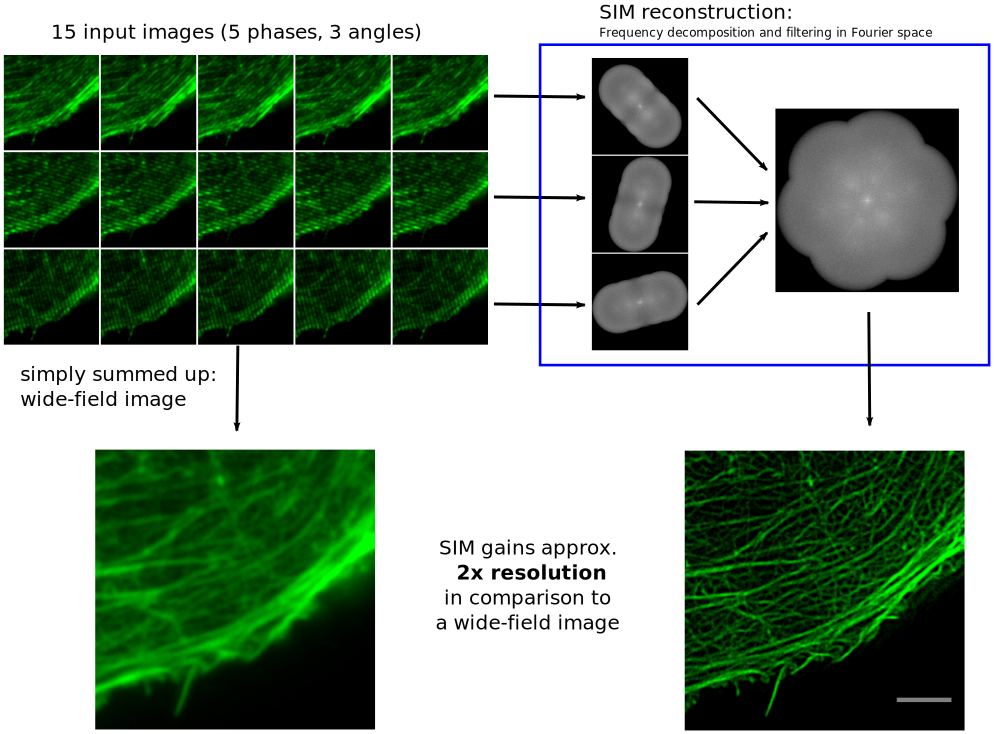

Structured Illumination Microscopy (SIM) provides a fast and gentle super-resolution approach for
fluorescence microscopy. The *fairSIM project* aims to provide a range of free and open-source
tools and resources for scientists working with SIM.

## The fairSIM ImageJ / FIJI plugin

We provide an open-source implementation of the reconstruction algorithms used for SIM.
It runs as a plugin to the popular image processing software [ImageJ](https://imagej.net/)
and the [FIJI](https://fiji.sc/) package.   

* The latest ready-to-use JAR file of the plugin can be found [here](https://github.com/fairSIM/fairSIM/releases/latest)
* The source code is found in our main repository on [github](https://www.github.com/fairSIM/fairSIM)
* There's also a [quickstart manual](https://github.com/fairSIM/fairSIM-documentation/releases/) for the plugin  
* [Screencast videos](./screencasts/) showing how to reconstruct SIM data

If you use fairSIM for your research or education, please cite our *associated publication*:
> M. Müller, V. Mönkemöller, S. Hennig, W. Hübner, T. Huser 
> _Open-source image reconstruction of super-resolution structured illumination
> microscopy data in ImageJ_, Nature Communications, 7(1), 10980.
> [doi:10.1038/ncomms10980](https://doi.org/10.1038/ncomms10980)

## The fairSIM VIGOR microscope & software

We developed a bespoke, multi-color, video-rate SIM microscope that
immediately reconstructs image data on-the-fly.

The system is documented here

> A. Markwirth, M. Lachetta, V. Mönkemöller, R. Heintzmann, W. Hübner, T. Huser, M. Müller
> _Video-rate multi-color structured illumination microscopy with simultaneous real-time reconstruction._ 
> Nature communications, 10(1), 1-11. [doi:10.1038/s41467-019-12165-x](https://doi.org/10.1038/s41467-019-12165-x)

## Supporting the project

Many research groups developing and applying SIM, as well as imaging facilities running SIM microscopes, profit
from and support the fairSIM project. 

**A list of official support statement [can be found here](supporters.html).**

## Current developments

* Various recent development (2016--2019) are summarized in [this talk](https://zenodo.org/record/2649890) from April 2019, given at the 'Focus on Microscopy' conference.  
* Support for _full 3D reconstruction_ is in _beta_. The current implementation can be found
in the [develop-3D-SIM](https://www.github.com/fairSIM/fairSIM/tree/develop-3D-SIM) branch, but 
there are known bugs compromising axial resolution.

## Reference / test datasets

A number of SIM raw data sets can be found in [this repository](https://github.com/fairSIM/test-datasets). They include data from commercial instruments (Delta Vision OMX v4, Zeiss Elyra) and home-build
systems. You can _reprocude all reconstruction_ 
from our [original publication](https://doi.org/10.1038/ncomms10980). 

* [OMX LSEC Membrane 680nm](https://github.com/fairSIM/test-datasets/releases/download/OMXv4-Bielefeld/OMX_LSEC_Membrane_680nm.tif)
* [OMX 200nm-Tetraspecks 680nm](https://github.com/fairSIM/test-datasets/releases/download/OMXv4-Bielefeld/OMX_Tetraspeck200_680nm.tif)
* [OMX U2OS Actin 525nm](https://github.com/fairSIM/test-datasets/releases/download/OMXv4-Bielefeld/OMX_U2OS_Actin_525nm.tif)
* [OMX U2OS Mitotracker 600nm](https://github.com/fairSIM/test-datasets/releases/download/OMXv4-Bielefeld/OMX_U2OS_Mitotracker_600nm.tif)
* [OMX U2OS Tubulin 525nm](https://github.com/fairSIM/test-datasets/releases/download/OMXv4-Bielefeld/OMX_U2OS_Tubulin_525nm.tif)
* [SLM-SIM 200nm-Tetraspeck 680nm](https://github.com/fairSIM/test-datasets/releases/download/SLM-SIM-Bielefeld/SLM-SIM_Tetraspeck200_680nm.tif)
* [TIRF-SIM Tubulin 525nm](https://github.com/fairSIM/test-datasets/releases/download/TIRF-SIM-Georgia/TIRF_Tubulin_525nm.tif)
* [Zeiss Actin 515nm (512x512 px crop)](https://github.com/fairSIM/test-datasets/releases/download/ZeissElyraS1-Wuerzburg/Zeiss_Actin_525nm_crop.tif)
* [Zeiss Actin 515nm](https://github.com/fairSIM/test-datasets/releases/download/ZeissElyraS1-Wuerzburg/Zeiss_Actin_525nm_large.tif)
* [Zeiss Mito 620nm (512x512 px crop)](https://github.com/fairSIM/test-datasets/releases/download/ZeissElyraS1-Wuerzburg/Zeiss_Mito_600nm_crop.tif)
* [Zeiss Mito 620nm](https://github.com/fairSIM/test-datasets/releases/download/ZeissElyraS1-Wuerzburg/Zeiss_Mito_600nm_large.tif)

The reconstruction can be run both using _estimated_ and experimentally determined transfers
functions. Both [parameter files](https://github.com/fairSIM/test-datasets/tree/master/parameters) and
[optical transfer functions](https://github.com/fairSIM/test-datasets/releases/download/Parameters-v1.0/OMX-OTFs.zip) are provided to test this feature.
 
* Datasets for the VIGOR live SIM reconstruction can be [found on Zenodo](https://zenodo.org/record/3295829).

# Contact & Development

The maintainer and lead developer of the fairSIM project is _Marcel Müller_

* web: [www.mueller-physics.org](https://www.mueller-physics.org)
* e-mail: [muellerphysics@gmail.com](mailto:muellerphysics@gmail.com)
* Twitter: [@mueller_physics](https://twitter.com/mueller_physics)
* ORCID: [0000-0002-2264-3643](https://orcid.org/0000-0002-2264-3643)
* Google Scholar: [Marcel Müller](https://scholar.google.com/citations?user=N29z1_wAAAAJ)
* LinkedIn: [mueller-physics](http://www.linkedin.com/in/mueller-physics)
* ResearchGate: [Marcel Müller](https://www.researchgate.net/profile/Marcel_Mueller10)

